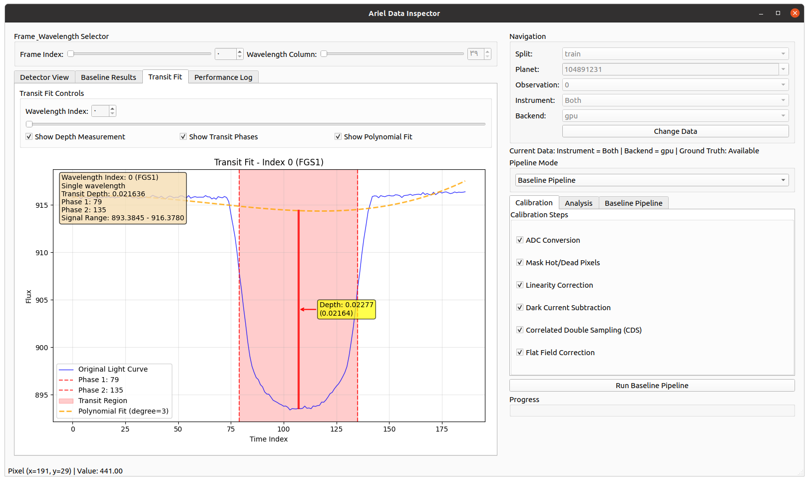

# ArielML: Exoplanet Data Analysis Pipeline



This project provides a comprehensive, high-performance Python pipeline for analyzing simulated data from the ESA Ariel Space Telescope, as part of the "Ariel Data Challenge 2025". The primary goal is to process raw time-series image data to recover the atmospheric transmission spectra of exoplanets.

## ✨ Features

* **Modular Library (`arielml`):** All core logic is encapsulated in a clean, scalable, and installable Python library.
* **High-Performance Backend:** A backend-agnostic design allows all numerical operations to run seamlessly on either a **CPU (NumPy)** or a **GPU (CuPy)** for maximum performance.
* **End-to-End Data Reduction:** Implements the full pipeline from raw data to clean, phase-folded light curves, including robust calibration, photometry, and detrending.
* **Dual-Instrument Support:** The baseline pipeline processes both FGS1 and AIRS-CH0 instruments simultaneously for comprehensive transit analysis.
* **Advanced Detrending Framework:**
    * Includes baseline Polynomial and Savitzky-Golay models.
    * Features per-wavelength Gaussian Process (GP) models for both **CPU (`george`)** and **GPU (`gpytorch`)**.
    * Implements a physically-motivated **Hybrid GP Model** that isolates common-mode instrumental noise before modeling wavelength-specific residuals.
* **Interactive Visualization Tool:** A powerful GUI built with PyQt6 for interactively exploring the data, visualizing the impact of each processing step, and comparing the performance of all detrending models.

## 📂 Project Structure

The project is organized into a clean and logical directory structure:

```plaintext
.
├── arielml/            # The core, installable Python library
│   ├── backend.py      # Handles CPU/GPU backend switching
│   ├── config.py       # Central configuration for paths and parameters
│   ├── utils.py        # Helper functions (e.g., transit mask calculation)
│   ├── data/           # Data processing modules
│   │   ├── analysis.py
│   │   ├── calibration.py
│   │   ├── detrending.py
│   │   ├── loaders.py
│   │   ├── observation.py
│   │   └── photometry.py
│   └── ...
├── assets/             # Screenshots and media files
│   └── data_inspector_screenshot.png
├── dataset/            # Target directory for raw competition data
│   └── .gitkeep
├── notebooks/          # Jupyter notebooks for experimentation
├── output/             # Target directory for generated files (models, submissions)
│   └── .gitkeep
├── tools/              # Standalone GUI applications
│   └── data_inspector.py
├── .gitignore          # Specifies files and directories to be ignored by Git
├── README.md           # This file
└── requirements.txt    # Project dependencies
```

## 🚀 Setup and Installation

Follow these steps to set up the project environment.

**1. Clone the Repository:**

```bash
git clone https://github.com/jalalirs/arielml
cd arielml
```

**2. Create a Virtual Environment:**
It is highly recommended to use a virtual environment.

```bash
python -m venv .venv
source .venv/bin/activate
```

**3. Install Dependencies:**
Install all required Python packages from the `requirements.txt` file.

```bash
pip install -r requirements.txt
```

*Note: For GPU support, you must have the NVIDIA CUDA Toolkit installed, then install the appropriate versions of `cupy`, `torch`, and `gpytorch` that are compatible with your CUDA version.*

**4. Download the Data:**
Download the competition data and place it inside the `dataset/` directory. The structure should look like:

```
dataset/
├── train/
├── test/
├── train.csv
└── ...
```

## 🛠️ Usage

### Running the Data Inspector Tool

The primary tool for visualization and debugging is the `Data Inspector`. To run it, execute the following command from the project's root directory:

```bash
python tools/data_inspector.py
```

This will launch the GUI (shown in the screenshot above), allowing you to load planet data, apply calibration steps, and interactively compare all detrending models (including the CPU, GPU, and Hybrid GP options) to visualize the final phase-folded transit signal.

#### Key Features of the Data Inspector:
- **📊 Interactive Visualization**: Real-time plotting with mouse-over coordinates
- **⚙️ Parameter Tuning**: Adjust pipeline parameters and see immediate results
- **🔄 Pipeline Comparison**: Switch between Preprocessing, Baseline, and Bayesian pipelines
  - *Note: Baseline pipeline requires both FGS1 and AIRS-CH0 instruments loaded*
- **📈 Multi-tab Analysis**: Separate tabs for different types of visualizations
- **🎚️ Transit Fit Analysis**: Wavelength-specific transit depth exploration
- **💾 Memory Management**: Efficient handling of large datasets

## 🔮 Next Steps

With the data processing foundation now complete and robust, the project will focus on the following machine learning and analysis tasks:

1.  **Feature Engineering:** Systematically extract the final transit depths and their uncertainties from the light curves produced by our best detrending models (e.g., the `HybridDetrender`).
2.  **Model Building:** Develop machine learning models (e.g., LightGBM, MLP) in `arielml/models/` to predict the transit spectrum from the engineered features.
3.  **Custom Loss Function:** Implement a custom loss function that directly optimizes for the competition's Gaussian Log-Likelihood (GLL) metric.
4.  **Pipeline Integration:** Create end-to-end training and prediction pipelines in `arielml/pipelines/` to generate the final competition submission.
